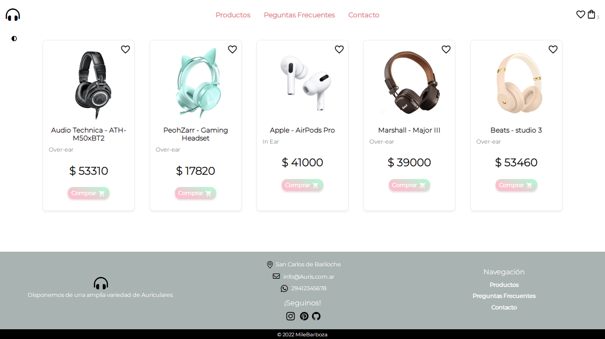

# Auris-js  e-commerce
Es un e-commerce &#128717;&#65039; que se centra en venta de una amplia variedad de Auriculares, donde el usuario puede interactuar con el buscador, filtro y favorito.   
Está hecha con JavaScript, HTML, CSS, SASS y Librerias. 	

 

 
    

